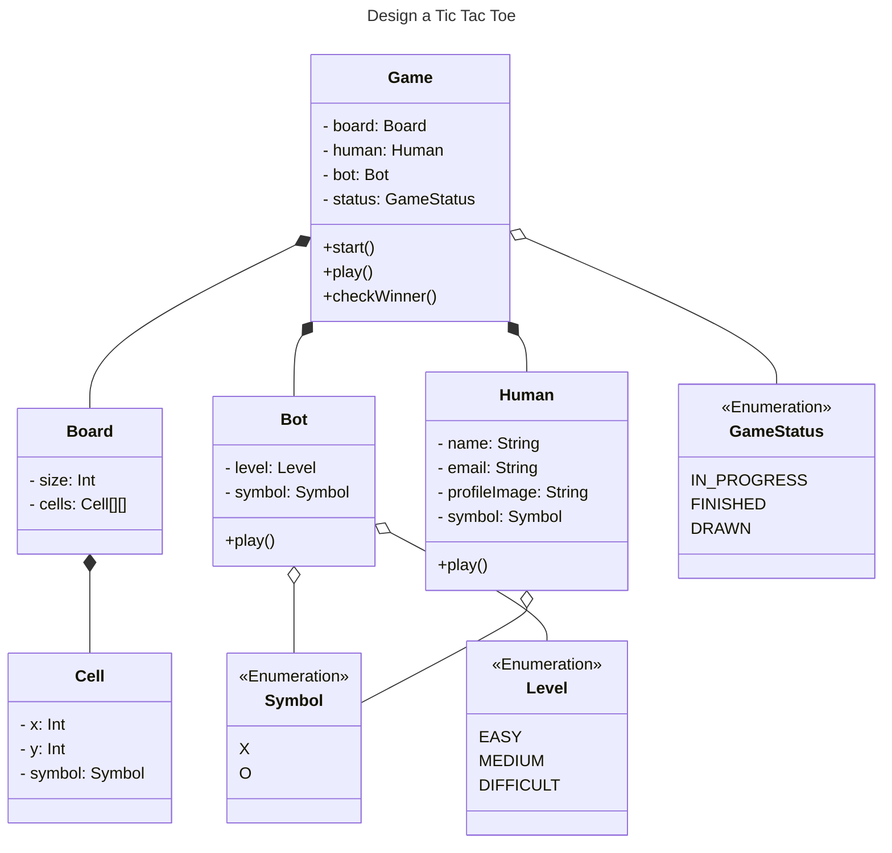
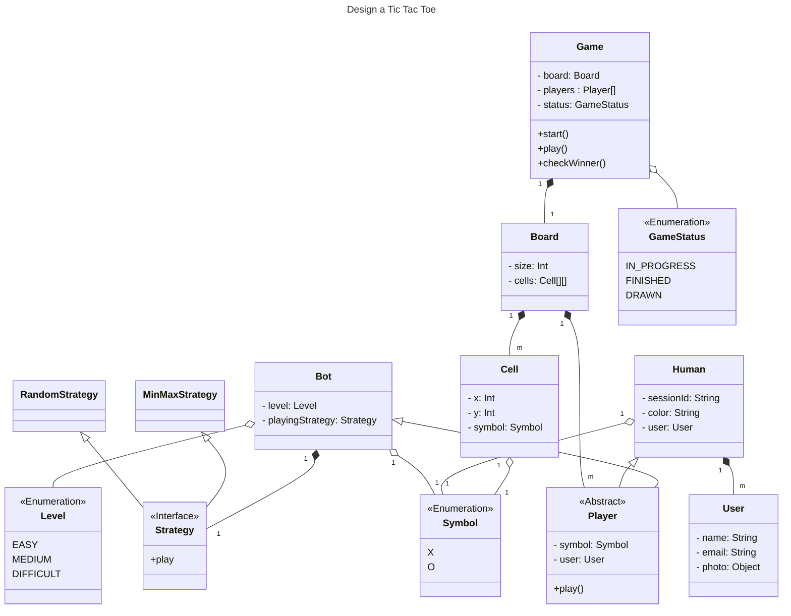

# Tic Tac Toe Design

## Problem Statement

**Definition**

TicTacToe is a 2 player game played on a 3 x 3 board. Each player is allotted a symbol (one X and one O). Initially, the board is empty. Alternatively, each player takes a turn and puts their symbol at any empty slot. The first player to get their symbol over a complete row OR a complete column OR a diagonal wins .
[Tic Tac Toe - Sample game](https://g.co/kgs/F4WLMjn)

**Expectations**
- The code should be working and functionally correct
- Good software design practices should be followed:
- Code should be modular, readable, extensible
- Separation of concern should be addressed
- Project structured well across multiple files/ packages
- Write unit tests
- No need of GUI

**Requirements**
- Board can be of any NxN size.
- There can be two players.
- Each player will be allotted a symbol.
- The symbol can be one of O and X.
- The players can be either humans or bots.
- Each human player will have a name, email and profile image.
- Each bot player will have a difficulty level.
- Any random player can start the game.
- Then the players will take turns alternatively.
- The player with any consecutive N symbols in a row, column or diagonal wins.
- If the board is full and no player has won, the game is a draw.

## Design

### Iteration 1

**Downsides**
1. Modification to support two human player needs modification of `Game` class - OCP violation
2. Field and method are duplicated in `Bot` and `Human` class
3. Memory usage in `Player` if there is multiple objects of same person

### Iteration 2

