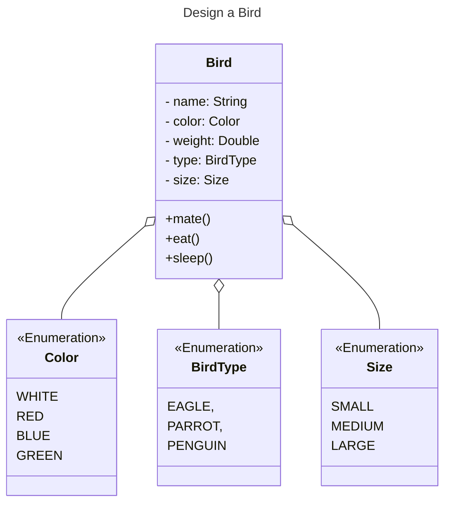
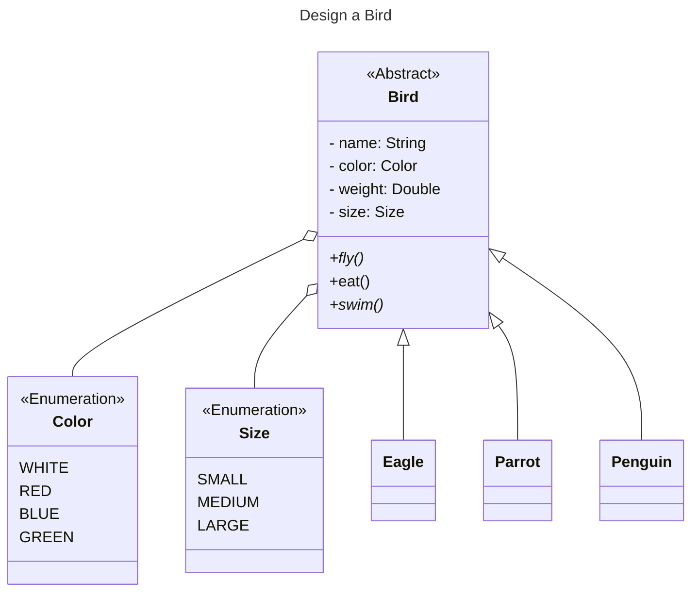
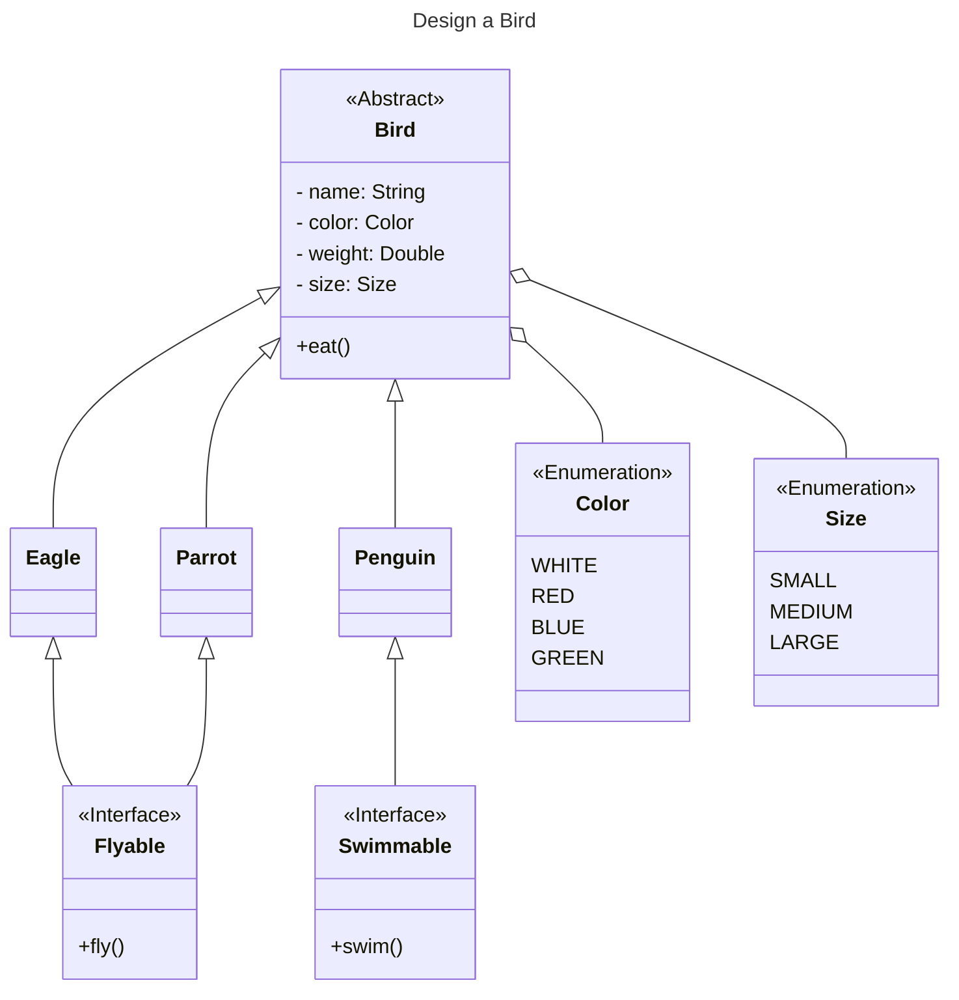

# SOLID principles

## Intent
- To solve practical problems in Software Development such as lack of modularity, complexity, rigidity, fragility.
- Attempt to language-agnostic standardisation in design practices

1. `S`ingle Responsibility Principle
2. `O`pen Closed Principle 
3. `L`iskov Substitution Principle 
4. `I`nterface Segregation Principle 
5. `D`ependency Inversion Principle

## Single Responsibility Principle
> an entity should have only one responsibility or only one reason to change

### Problem

- Tight coupling due to God classes or monster methods.


```
Cyclomatic complexity is a linting method to detect god classes/ monster methods.
```
### Solution

- Ensure every class has only one responsibility
- Often depends on Developer's perception

## Open Closed Principle
> open for extension but closed for modification

### Problem
- New features requiring modification of existing code, introduce the risk of breaking existing functionality.

### Solution
- Design in such way future scope of the entity can be extended without altering existing code.

## Liskov Substitution Principle
> Subtypes should be substitutable for their base type without any special adjustment

### Problem
- When subclass doesn't promise or meet the expected behaviour of the base class, logically it points out to SRP violation.
- Cause errors or even program crash.

### Solution
- Use abstract classes or interfaces to segregate the type.

## Interface Segregation Principle
> large interfaces should be split into smaller ones, so that implementing classes are only concerned about methods that are of interest to them

### Problem
- fat interfaces cause unused dependencies and are unmaintainable

### Solution
- always design specific lean interfaces

## Dependency Inversion Principle
> High-level modules should not depend on low-level modules, both will depends on abstractions

### Problem
- High-level depending on low-level module requires modification not extension for future scope - violating OCP
- Cause rigidity and affects flexibility

## Solution
- Always create dependencies to abstract modules

# Design a Bird

## Iteration 1



- `fly` method is loaded with functionality of all three `BirdTypes` - monster method violating SRP and OCP
- `Bird` class handles implementation of all types of birds.

## Iteration 2



- Penguin doesn't fly while rest  don't swim - substituting base type to subtype requires exception handling in overridden `fly()` which is violation of LSP

## Iteration 3




